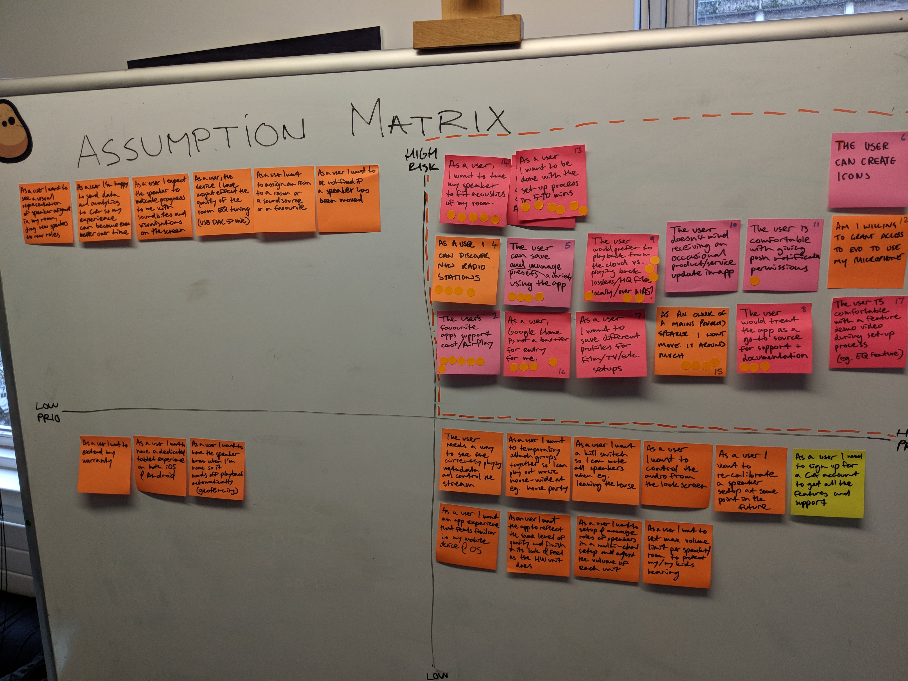

| Expertise        | Platforms           | Deliverables  |
| ------------- |-------------          | -----|            
| Design, Interaction and Development     | iOS and Android         | UI, UX and Strategy           |

###The Problem

[Cambridge Audio](https://www.cambridgeaudio.com/gbr/en) came to [Potato]() to help them design an iOS and Android application for a new multi-room speaker range - The Evo system. They also wanted to learn product development and lean UX.

###The Approach

We created a plan that worked with their (tight) budget and their internal development plan.
1 week of lean research, the following week was validation sprint with the client after that we moved into

###Gathering Insights 

Ahead of the validation sprint, we wanted to understand people’s behaviour and needs when is comes to how they consume music within their household. We decided the best way was to gather quantitive research; to do this we run a survey and broadcasted it on our social channels to.  
We run the survey for about a week and got 175 response with a good mix of ages and demographics.  We distilled down the findings into key insights 

1. The set-up of the speaker is vital, it needs to be timely and easy. It’s the first touchpoint for the customer so it needs to be simple and positive. 

2. The supporting app is important to users. The application gives you the opportunity to be intelligent, delightful but must not be intrusive. 

3. There needs to be a connection that is reliable and always connects to their speaker. If there is a drop out they will blame the speaker. 4
4. Customers don’t want to be in a walled garden with their speaker. They have multiple sources and they want to choose how they listen to music.

---

###Validation Workshop 

Working with senior members of the Cambridge Audio team we looked to gain a shared understanding of the problem and the users. During the first day we started with an empathy map to get under the skin of the segments. After that we then used the Roman Pincher product vision board and created one for the Evo system. 

We spent the following day gathering all the assumptions we believed the product is/does/feels/looks like and mapped them on the assumption matrix. We focused on the riskiest and the highest priority assumptions. Using these assumptions we then created hypothesis that we wanted to test.   

####Sketching

The following day we moved into a sketching,  Taking inspiration from the “Google Design Sprint” we held a morning of sketching sessions based on the assumptions and hypothesis. Starting with crazy eight’s those ideas then influenced “Solution creation” from that we then created a storyboard of the prototype. Whilst we created the storyboard we mapped all the hypothesis that we created in the previous day - this made sure that we had the right tests we wanted to validate. 

####Prototype 

Our next focus was to create a prototype to validate with users if our hypothesis are correct or not. (To do create a prototype). As some of our hypothesis could not be tested in the prototype we ran another survey.

---
